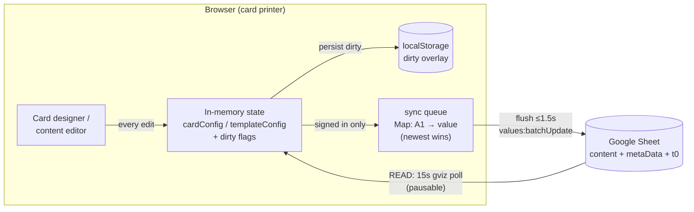
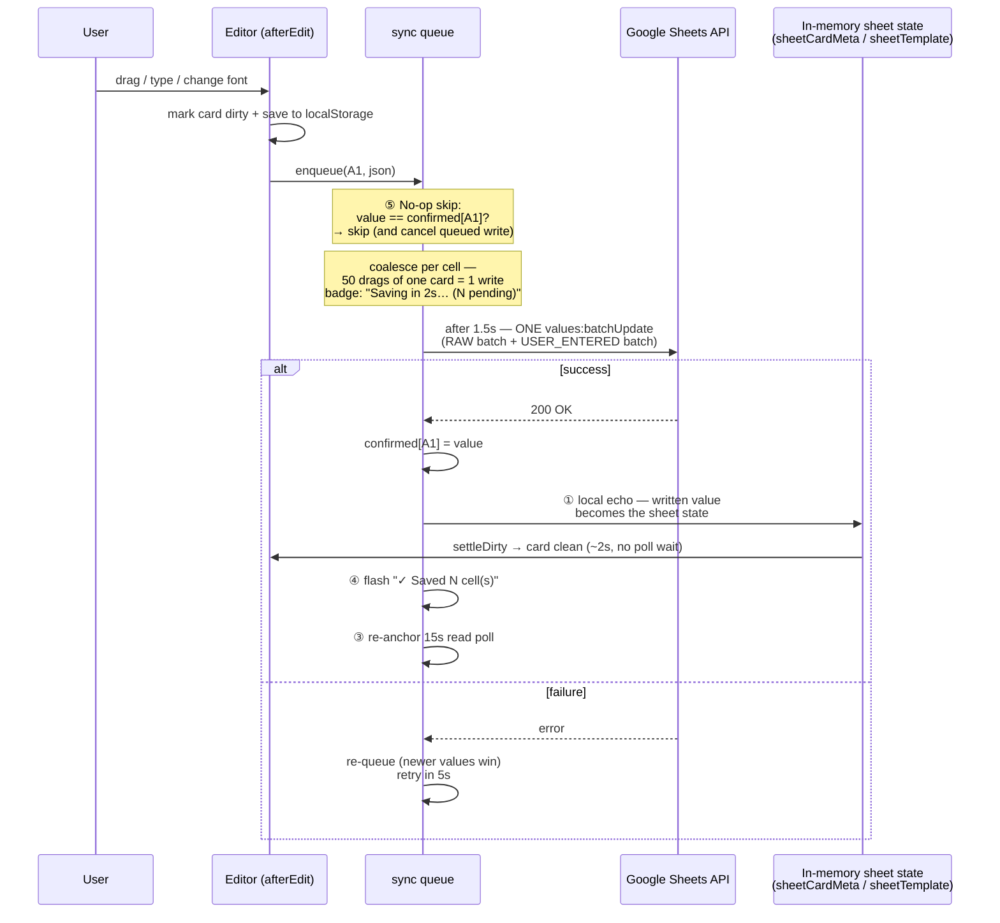
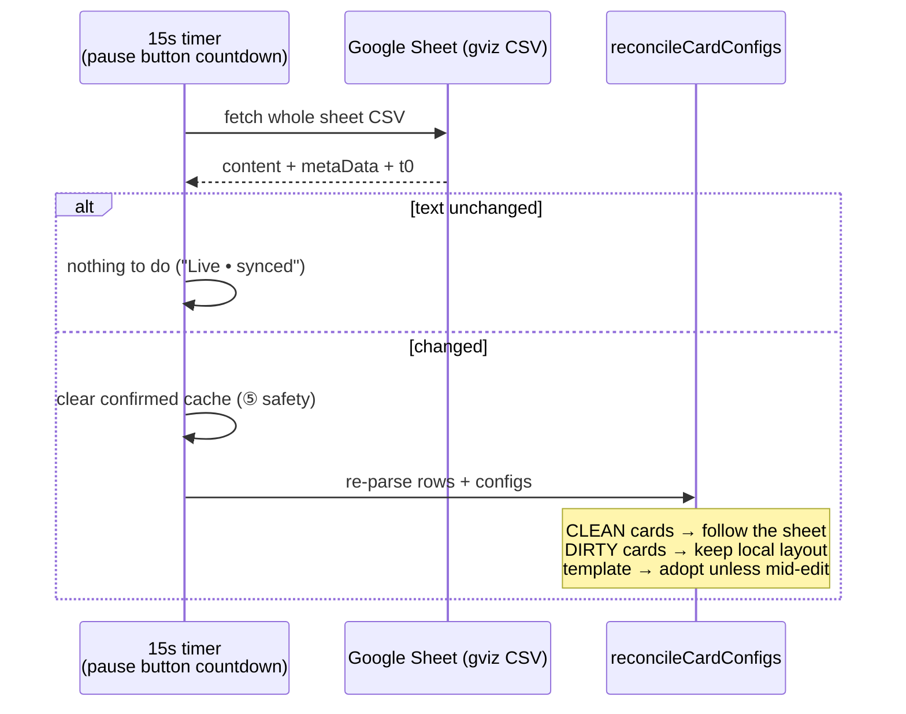
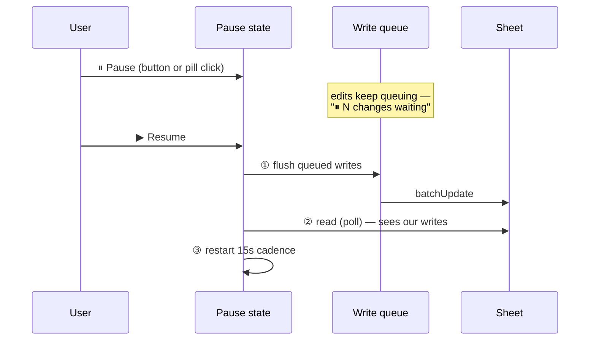
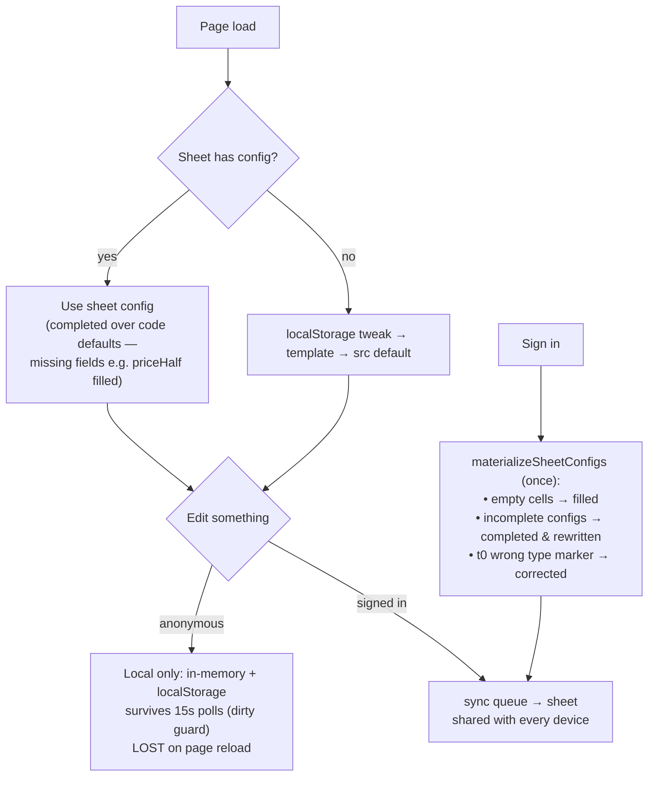
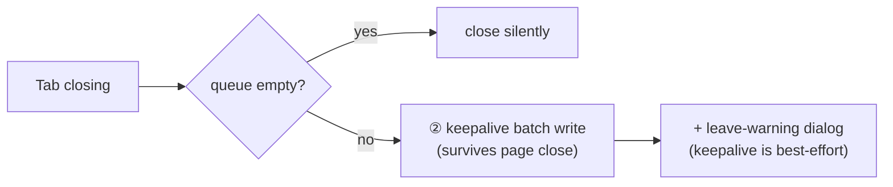

# Sheet Sync Manager — Update Sequence

How the card printer keeps the designer, the PDF preview, and the shared Google Sheet in sync.
Source: `index.html` — `sync` object, `pollSheetOnce`, `materializeSheetConfigs`.

---

## 1. The big picture — two independent channels

* **Writes** (right): only when signed in, debounced 1.5 s, batched into 1–2 HTTP calls.
* **Reads** (bottom): the 15 s poll — one CSV containing content **and** layout configs.
* **Pause freezes BOTH channels**: reads stop, and queued writes wait (badge/pill: `⏸ N changes waiting`). Resume drains in sync order: ① flush writes → ② read → ③ restart the 15 s cadence. Tab close while paused still fires the keepalive rescue write.

---

## 2. Write path — what happens when you edit (signed in)

---

## 3. Read path — the 15 s poll

**Pause** freezes the whole sync manager — this read channel (content *and* configs) **and** the write queue. On resume: writes flush first, then this poll runs, then the 15 s timer restarts.

---

## 4. Lifecycle — anonymous vs signed in

---

## 5. Close-tab safety net

---

## Status surfaces (consolidated)

| Surface | Owns | Example |
|---|---|---|
| **Sync pill** (fixed top-right) | the ONE at-a-glance data in/out state | `🟢 Live — updated just now` · `💾 Saving 3 changes (2s)…` · `✓ All changes saved` · `⏸ Paused — not pulling updates` · `✏️ Local preview — sign in to save` · `⚠ Save failed — retrying` |
| **Designer badge** (on the card) | save countdown + font/auto-flow chips | `💾 Saving 3 changes (2s)…` → `✓ All changes saved` |
| **Pause button** | read-poll control | `Pause auto-refresh (12s)` + draining fill / amber `⏸ Paused` |
| **Section 1 statuses** | setup only | connect errors, `Editable • Tab • 147 rows` |

Pill priority (top wins): write error → read error → saving → just-saved → paused → anonymous-with-local-edits → live.

## Timing cheat sheet

| Thing | Cadence | Visual |
|---|---|---|
| Write flush | 1.5 s after first queued edit | pill + badge: `💾 Saving N changes (2s)…` |
| Write retry on failure | 5 s | pill: `⚠ Save failed — retrying` |
| Save confirmation | ~2 s (local echo) | pill + badge flash: `✓ All changes saved` |
| Read poll | 15 s, pausable | pause button countdown + pill `updated Ns ago · ↻ 12s` |
| Paused | reads AND writes frozen (queue waits) | amber pill `⏸ Paused — N changes waiting` + amber button |
| Resume | write → read → restart cadence | pill walks `💾 Saving… → ✓ → 🟢 Live` |

**Numbered optimizations** in the diagrams: ① local echo ② keepalive close-flush ③ poll re-anchor after own write ④ countdown + ✓ flash ⑤ no-op write skip.
